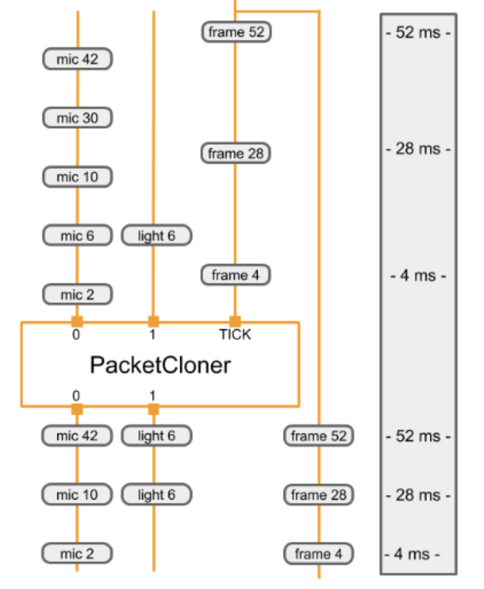

# Calculators

每個 calculator 都是 graph 的一個 node。 Graph 中的每一個 node 都 implemented 為 Calculator，大部分 graph 執行發生在其 calculator 內部。Calculator 可以接收零個或多個 input stream and/or side packets 並產生零個或多個 output streams and/or side packets。

## CalculatorBase

A calculator is created by defining a new sub-class of the `CalculatorBase` class, implementing a number of methods, and registering the new sub-class with Mediapipe. At a minimum, a new calculator must implement the below four methods:

- `GetContract()`

    Calculator authors can specify the expected types of inputs and outputs of a calculator in `GetContract()`. When a graph is initialized, the framework calls a static method to verify if the packet types of the connected inputs and outputs match the information in this specification.

- `Open()`

    After a graph starts, the framework calls `Open()`. The input side packets are available to the calculator at this point. `Open()` interprets the node configuration operations (see Graphs) and prepares the calculator's per-graph-run state. This function may also write packets to calculator outputs. An error during `Open()` can terminate the graph run.

- `Process()`

    For a calculator with inputs, the framework calls `Process()` repeatedly whenever at least one input stream has a packet available. The framework by default guarantees that all inputs have the same timestamp (see Synchronization for more information). Multiple `Process()` calls can be invoked simultaneously when parallel execution is enabled. If an error occurs during `Process()`, the framework calls Close() and the graph run terminates.

- `Close()`

    After all calls to `Process()` finish or when all input streams close, the framework calls `Close()`. This function is always called if `Open()` was called and succeeded and even if the graph run terminated because of an error. No inputs are available via any input streams during `Close()`, but it still has access to input side packets and therefore may write outputs. After `Close()` returns, the calculator should be considered a dead node. The calculator object is destroyed as soon as the graph finishes running.

The following are code snippets from [CalculatorBase.h](https://github.com/google/mediapipe/blob/master/mediapipe/framework/calculator_base.h).

```cpp
class CalculatorBase {
 public:
  ...

  // The subclasses of CalculatorBase must implement GetContract.
  static absl::Status GetContract(CalculatorContract* cc);

  // Open is called before any Process() calls, on a freshly constructed
  // calculator.  Subclasses may override this method to perform necessary
  // setup, and possibly output Packets and/or set output streams' headers.
  virtual absl::Status Open(CalculatorContext* cc) {
    return absl::OkStatus();
  }

  // Processes the incoming inputs. May call the methods on cc to access
  // inputs and produce outputs.
  virtual absl::Status Process(CalculatorContext* cc) = 0;

  // Is called if Open() was called and succeeded.  Is called either
  // immediately after processing is complete or after a graph run has ended
  // (if an error occurred in the graph).
  virtual absl::Status Close(CalculatorContext* cc) {
    return absl::OkStatus();
  }

  ...
};
```

## Identifying inputs and outputs

Calculator 的 public interface 由一組 input streams 和 output streams 組成。在 `CalculatorGraphConfiguration` 中，一些 calculator 的 output 會使用 `named streams` 接到其他 calculator 的 input。 Stream names 通常是小寫形式，而 input/output tags 通常是大寫形式。在下面的範例中，tag name: `VIDEO` 的輸出使用名為 `video_stream` (stream nameds) 的流連接到 tag name: `VIDEO_IN`

```proto
# Graph describing calculator SomeAudioVideoCalculator
node {
  calculator: "SomeAudioVideoCalculator"
  input_stream: "INPUT:combined_input"
  output_stream: "VIDEO:video_stream"
}
node {
  calculator: "SomeVideoCalculator"
  input_stream: "VIDEO_IN:video_stream"
  output_stream: "VIDEO_OUT:processed_video"
}
```

Input and output streams can be identified by index number, by tag name, or by a combination of tag name and index number, as below:

```proto
# Graph describing calculator SomeAudioVideoCalculator
node {
  calculator: "SomeAudioVideoCalculator"
  input_stream: "combined_input"
  output_stream: "VIDEO:video_stream"
  output_stream: "AUDIO:0:audio_left"
  output_stream: "AUDIO:1:audio_right"
}

node {
  calculator: "SomeAudioCalculator"
  input_stream: "audio_left"
  input_stream: "audio_right"
  output_stream: "audio_energy"
}
```

In the calculator implementation, inputs and outputs are also identified by tag name and index number. In the function below input and output are identified:

```cpp
// c++ Code snippet describing the SomeAudioVideoCalculator GetContract() method
class SomeAudioVideoCalculator : public CalculatorBase {
 public:
  static absl::Status GetContract(CalculatorContract* cc) {
    cc->Inputs().Index(0).SetAny();
    // SetAny() is used to specify that whatever the type of the
    // stream is, it's acceptable.  This does not mean that any
    // packet is acceptable.  Packets in the stream still have a
    // particular type.  SetAny() has the same effect as explicitly
    // setting the type to be the stream's type.
    cc->Outputs().Tag("VIDEO").Set<ImageFrame>();
    cc->Outputs().Get("AUDIO", 0).Set<Matrix>();
    cc->Outputs().Get("AUDIO", 1).Set<Matrix>();
    return absl::OkStatus();
  }
```

- By index number: The combined input stream is identified simply by index `0`.
- By tag name: The video output stream is identified by tag name `"VIDEO"`.
- By tag name and index number: The output audio streams are identified by the combination of the tag name `AUDIO` and the index numbers `0` and `1`.

## Processing

`Process()` called on a `non-source node` must return `absl::OkStatus()` to indicate that all went well, or any other status code to signal an error

> If a non-source calculator returns `tool::StatusStop()`, then this signals the graph is being cancelled early. In this case, all source calculators and graph input streams will be closed (and remaining Packets will propagate through the graph).

Graph 中的 source node 將繼續調用 `Process()`，只要它 return `absl::OkStatus()`，要指明沒有更多 data 要生成時，請 return `tool::StatusStop()`。 任何其狀態都表示發生了 error 。

`Close()` returns `absl::OkStatus()` 表示成功。 任何其他狀態都表示失敗。

### Example

以下是基本的 `Process()` function。它使用 `Input()` method (which can be used only if the calculator has a single input) 來請求 input data。然後使用 `std::unique_ptr` 來 allocate 一個 output packet 所需要的 memory，並進行計算。完成後，它會在將指針添加到 output stream 時釋放指針。

```cpp
absl::Status MyCalculator::Process() {
  const Matrix& input = Input()->Get<Matrix>();
  std::unique_ptr<Matrix> output(new Matrix(input.rows(), input.cols()));
  // do your magic here....
  //    output->row(n) =  ...
  Output()->Add(output.release(), InputTimestamp());
  return absl::OkStatus();
}
```

## Calculator options

Calculators accept processing parameters through

1. input stream packets
2. input side packets
3. calculator options

Calculator options 如果有指定的話就是 `node_options` 這個 key，如下所示:

```proto
node {
  calculator: "TfLiteInferenceCalculator"
  input_stream: "TENSORS:main_model_input"
  output_stream: "TENSORS:main_model_output"
  node_options: {
    [type.googleapis.com/mediapipe.TfLiteInferenceCalculatorOptions] {
      model_path: "mediapipe/models/detection_model.tflite"
    }
  }
}
```

**Not all calculators accept calculator options**. In order to accept options, a calculator will normally define a new protobuf message type to represent its options, such as `PacketClonerCalculatorOptions`. The calculator will then read that protobuf message in its `CalculatorBase::Open` method, and possibly also in its `CalculatorBase::GetContrac`t function or its `CalculatorBase::Process` method. Normally, the new protobuf message type will be defined as a protobuf schema using a **".proto"** file and a `mediapipe_proto_library()` build rule.

```starlark
mediapipe_proto_library(
  name = "packet_cloner_calculator_proto",
  srcs = ["packet_cloner_calculator.proto"],
  visibility = ["//visibility:public"],
  deps = [
    "//mediapipe/framework:calculator_options_proto",
    "//mediapipe/framework:calculator_proto",
  ],
)
```

## Example calculator

下面實作一個 `PacketClonerCalculator`，他的功能很簡單，只是按需求生成最新 input packets 的 copy。

`PacketClonerCalculator` 用在當你的 data 時間沒有完全對齊時。假設我們有一個房間，裡面有麥克風、light sensor 和 camera，每個 sensor 獨立運作並且間歇性的收集資料，假設每個 sensor 的輸出為:

- `microphone` = loudness in decibels of sound in the room (Integer)
- `light sensor` = brightness of room (Integer)
- `video camera` = RGB image frame of room (ImageFrame)

那麼這個簡單的 perception pipeline 旨在處理來自這三個 sensor 的 data，以便在之後我們需要同步這三個 data 時使用，要使用 MediaPipe 做到這點，我們的 perception pipeline 有以下 3 個 input streams:

- `room_mic_signal` - Each packet of data in this input stream is integer data representing how loud audio is in a room with timestamp.
- `room_lightening_sensor` - Each packet of data in this input stream is integer data representing how bright is the room illuminated with timestamp.
- `room_video_tick_signal` - Each packet of data in this input stream is imageframe of video data representing video collected from camera in the room with timestamp.

如下所示:

```cpp
// This takes packets from N+1 streams, A_1, A_2, ..., A_N, B.
// For every packet that appears in B, outputs the most recent packet from each
// of the A_i on a separate stream.

#include <vector>

#include "absl/strings/str_cat.h"
#include "mediapipe/framework/calculator_framework.h"

namespace mediapipe {

// For every packet received on the last stream, output the latest packet
// obtained on all other streams. Therefore, if the last stream outputs at a
// higher rate than the others, this effectively clones the packets from the
// other streams to match the last.
//
// Example config:
// node {
//   calculator: "PacketClonerCalculator"
//   input_stream: "first_base_signal"
//   input_stream: "second_base_signal"
//   input_stream: "tick_signal"
//   output_stream: "cloned_first_base_signal"
//   output_stream: "cloned_second_base_signal"
// }
//
class PacketClonerCalculator : public CalculatorBase {
 public:
  static absl::Status GetContract(CalculatorContract* cc) {
    const int tick_signal_index = cc->Inputs().NumEntries() - 1;
    // cc->Inputs().NumEntries() returns the number of input streams
    // for the PacketClonerCalculator
    for (int i = 0; i < tick_signal_index; ++i) {
      cc->Inputs().Index(i).SetAny();
      // cc->Inputs().Index(i) returns the input stream pointer by index
      cc->Outputs().Index(i).SetSameAs(&cc->Inputs().Index(i));
    }
    cc->Inputs().Index(tick_signal_index).SetAny();
    return absl::OkStatus();
  }

  absl::Status Open(CalculatorContext* cc) final {
    tick_signal_index_ = cc->Inputs().NumEntries() - 1;
    current_.resize(tick_signal_index_);
    // Pass along the header for each stream if present.
    for (int i = 0; i < tick_signal_index_; ++i) {
      if (!cc->Inputs().Index(i).Header().IsEmpty()) {
        cc->Outputs().Index(i).SetHeader(cc->Inputs().Index(i).Header());
        // Sets the output stream of index i header to be the same as
        // the header for the input stream of index i
      }
    }
    return absl::OkStatus();
  }

  absl::Status Process(CalculatorContext* cc) final {
    // Store input signals.
    for (int i = 0; i < tick_signal_index_; ++i) {
      if (!cc->Inputs().Index(i).Value().IsEmpty()) {
        current_[i] = cc->Inputs().Index(i).Value();
      }
    }

    // Output if the tick signal is non-empty.
    if (!cc->Inputs().Index(tick_signal_index_).Value().IsEmpty()) {
      for (int i = 0; i < tick_signal_index_; ++i) {
        if (!current_[i].IsEmpty()) {
          cc->Outputs().Index(i).AddPacket(
              current_[i].At(cc->InputTimestamp()));
          // Add a packet to output stream of index i a packet from inputstream i
          // with timestamp common to all present inputs
        } else {
          cc->Outputs().Index(i).SetNextTimestampBound(
              cc->InputTimestamp().NextAllowedInStream());
          // if current_[i], 1 packet buffer for input stream i is empty, we will set
          // next allowed timestamp for input stream i to be current timestamp + 1
        }
      }
    }
    return absl::OkStatus();
  }

 private:
  std::vector<Packet> current_;
  int tick_signal_index_;
};

REGISTER_CALCULATOR(PacketClonerCalculator);
}  // namespace mediapipe
```

通常，calculator 只有一個 `.cc` file，不需要 `.h`，因為 `mediapipe` 使用 `registration` 來讓 calculator 為它所知。 在我們定義 calculator class 後，使用 macro 調用 `REGISTER_CALCULATOR(calculator_class_name)` 對其進行註冊。

下面是一個簡單的 MediaPipe graph，它有 3 個 input streams、1 個 node (PacketClonerCalculator) 和 2 個 output streams。

```proto
input_stream: "room_mic_signal"
input_stream: "room_lighting_sensor"
input_stream: "room_video_tick_signal"

node {
  calculator: "PacketClonerCalculator"
  input_stream: "room_mic_signal"
  input_stream: "room_lighting_sensor"
  input_stream: "room_video_tick_signal"
  output_stream: "cloned_room_mic_signal"
  output_stream: "cloned_lighting_sensor"
}
```

The diagram below shows how the `PacketClonerCalculator` defines its output packets (bottom) based on its series of input packets (top).


