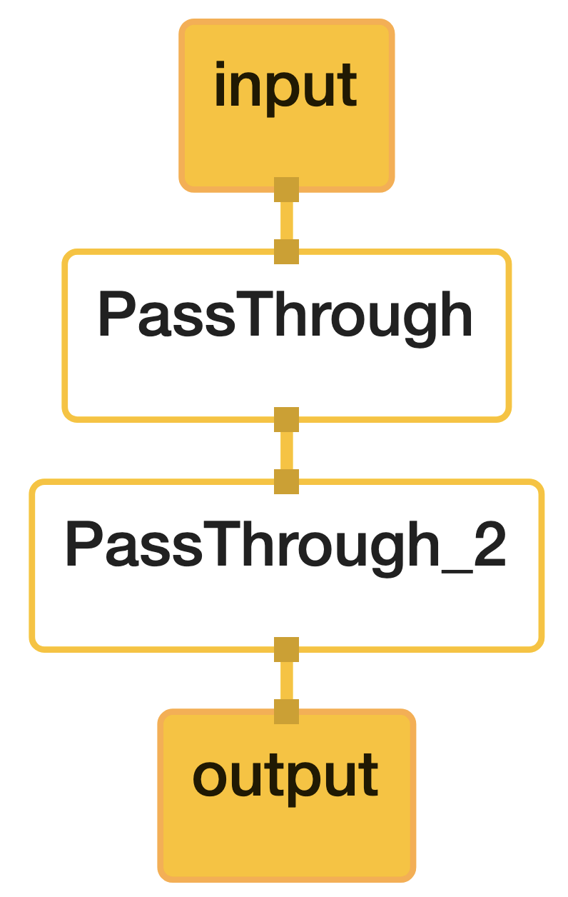

# Hello World! in C++

Detail code please see [mediapipe/kaka_examples/00_hello_world](https://github.com/kaka-lin/mediapipe/tree/kaka/mediapipe/kaka_examples/00_hello_world)

Usage:

```bash
$ bazel run --define MEDIAPIPE_DISABLE_GPU=1 \
    mediapipe/kaka_examples/00_hello_world:hello_world
```

## Step 1. Configure a simple graph

The `"hello world"` example uses a simple MediaPipe graph in the `PrintHelloWorld()` function, defined in a [CalculatorGraphConfig](https://github.com/google/mediapipe/blob/master/mediapipe/framework/calculator.proto) proto.

First, we have to create MediePipe graph as protobuf text format

```cpp
std::string k_proto = R"pbtxt(
    input_stream: "input"
    output_stream: "output"
    node {
      calculator: "PassThroughCalculator"
      input_stream: "input"
      output_stream: "output1"
    }
    node {
      calculator: "PassThroughCalculator"
      input_stream: "output1"
      output_stream: "output"
    }
  )pbtxt";
```

You can visualize this graph using [MediaPipe Visualizer](https://viz.mediapipe.dev/) by pasting the CalculatorGraphConfig content below into the visualizer.

```proto
input_stream: "input"
output_stream: "output"
node {
  calculator: "PassThroughCalculator"
  input_stream: "input"
  output_stream: "output1"
}
node {
  calculator: "PassThroughCalculator"
  input_stream: "output1"
  output_stream: "output"
}
```



Next, parse this string into a protobuf CalculatorGraphConfig object

```cpp
CalculatorGraphConfig config =
  ParseTextProtoOrDie<CalculatorGraphConfig>(k_proto);
```

## Step 2. Create MediaPipe Graph and initialize it with config

```cpp
CalculatorGraph graph;
MP_RETURN_IF_ERROR(graph.Initialize(config));
```

## Step 3. Input packets and Output packets

### Output packets

How do you recieve output packets from the graph (stream "output")?

1. [OutputStreamPoller](https://github.com/google/mediapipe/blob/master/mediapipe/framework/output_stream_poller.h#L25): synchronous logic
2. `ObserveOutputStream`: a callback, asynchronous logic

In this example we using OutputStreamPoller. Create an `OutputStreamPoller` object that is connected to the output stream in order to later retrieve the graph output

```cpp
ASSIGN_OR_RETURN(OutputStreamPoller poller,
                 graph.AddOutputStreamPoller("output"));
```

### Run the graph

Run the graph with `StartRun`, it usually starts in parallel threads and waits for input data.

```cpp
MP_RETURN_IF_ERROR(graph.StartRun({}));
```

### Input packets

Creates 10 input packets that contains the same string "Hello World!"

Using [MakePacket](https://github.com/google/mediapipe/blob/master/mediapipe/framework/packet.h) creates a packet. And unsing `AddPacketToInputStream` send this packet to the stream input.

```cpp
for (int i = 0; i < 10; ++i) {
  MP_RETURN_IF_ERROR(graph.AddPacketToInputStream("input",
                     MakePacket<std::string>("Hello World!").At(Timestamp(i))));
}
```

Close input stream "input" to finish the graph run.

```cpp
MP_RETURN_IF_ERROR(graph.CloseInputStream("input"));
```

> signal MdeiaPipe that no more packets will be sent to "input"

### Get the output packets string

Through the `OutputStreamPoller` object the example then retrieves all 10 packets from the output stream, gets the string content out of each packet and prints it to the output log.

```cpp
mediapipe::Packet packet;
while (poller.Next(&packet)) {
  LOG(INFO) << packet.Get<std::string>();
}
```

## Step 4. Finish graph

Wait for the graph to finish, and return graph status

```cpp
return graph.WaitUntilDone();
```

or

```cpp
MP_RETURN_IF_ERROR(graph.WaitUntilDone());
return mediapipe::OkStatus();
``
