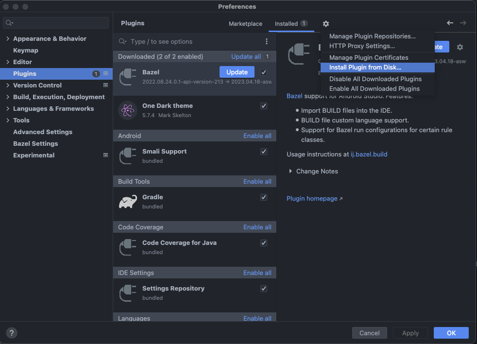
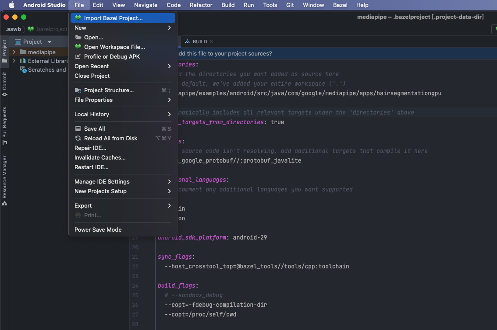
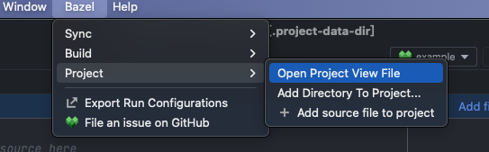
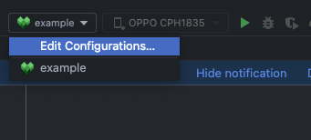
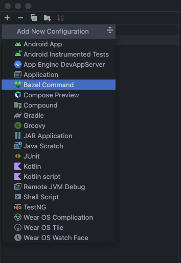
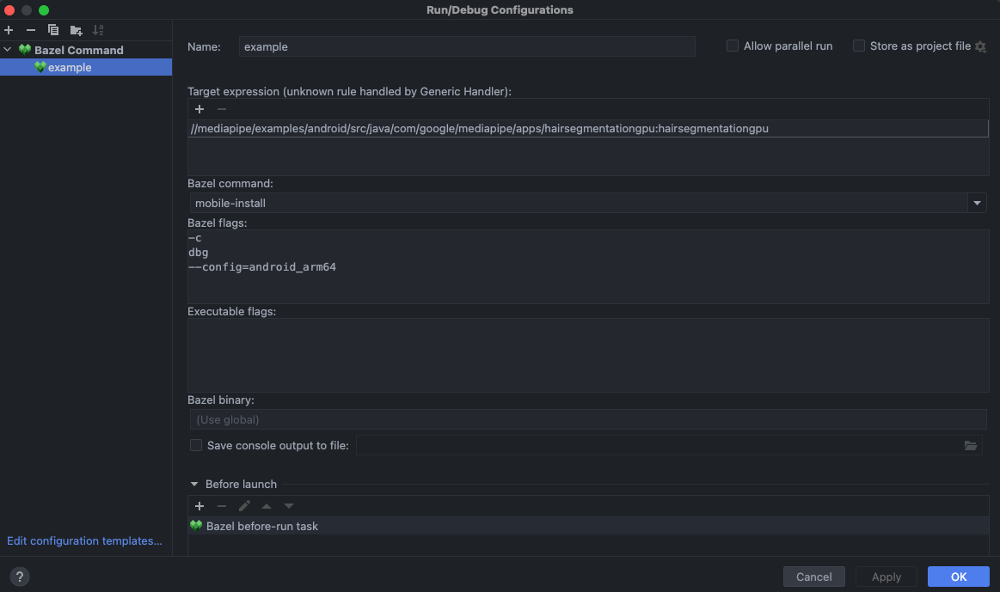
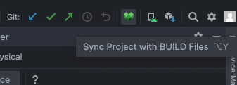

# MediaPipe Framework on Android

下面會教學如何建構 `Android example apps with MediaPipe Framework`.

## Build Android example apps with Bazel

### Prerequisite

- Install MeidaPipe Framework，請參考: [install MediaPipe Framework](https://developers.google.com/mediapipe/framework/getting_started/install)

- Install/Setup Java Runtime

    macOS:

    ```sh
    $ brew install java
    $ sudo ln -sfn /opt/homebrew/opt/openjdk/libexec/openjdk.jdk /Library/Java/JavaVirtualMachines/openjdk.jdk
    ```

    然後在 `.zshrc` or `.bashrc` 中新增以下:

    ```sh
    JAVA_HOME="/opt/homebrew/opt/openjdk"
    PATH="$JAVA_HOME/bin:$PATH"
    ```

    測試是否安裝成功:

    ```sh
    $ java --version
    ```

    輸出會類似下面:
    ```
    openjdk 20.0.1 2023-04-18
    OpenJDK Runtime Environment Homebrew (build 20.0.1)
    OpenJDK 64-Bit Server VM Homebrew (build 20.0.1, mixed mode, sharing)
    ```

- Install Android Studio
    - Android Studio: Dolphin 2021.3.1 Patch 1 [Download for M1 Mac](https://redirector.gvt1.com/edgedl/android/studio/install/2021.3.1.17/android-studio-2021.3.1.17-mac_arm.dmg)
    - Setup Android SDK release 30.0 above.
    - Setup Android NDK version between 18 and 21.

      > SDK 與 NDK 設置請看下面。

- Download Android Studio Bazel plugin
  -  [2022.08.24 stable](https://plugins.jetbrains.com/plugin/download?rel=true&updateId=220829)


### Setup

#### 1. Bazel plugin

安裝指定版本的 AS Bazel plugin，這裡注意請不要從 Marketplace下載，也不要隨意更新 Plugin。如下:

> Android Studio > Settings



選擇剛剛所下載的 `.zip` 檔安裝即可。

#### 2. Andorid SDK and NDK

可以直接從 Android Studio 安裝，版本如下:

- Android SDK: 30.0.0 and above
- Android NDK: 18 ~ 21

但也可以透過 mediapipe repository 中提供的 [setup_android_sdk_and_ndk.sh](https://github.com/google/mediapipe/blob/master/setup_android_sdk_and_ndk.sh) 來下載並安裝 SDK 與 NDK。

在設置 Android SDK 和 NDK 路徑，如下:

`.zshrc` or `.bashrc`

```sh
ANDROID_HOME=<path to the Android SDK>
ANDROID_NDK_HOME=<path to the Android NDK>

# for adb
PATH="$ANDROID_HOME/platform-tools:$PATH"
```

然後在 [WORKSPACE](https://github.com/google/mediapipe/blob/master/WORKSPACE) 檔案中增加 `android_ndk_repository()` 和 `android_sdk_repository()` 如下所示:

```starlark
android_sdk_repository(name = "androidsdk", path = <ANDROID_HOME>)
android_ndk_repository(name = "androidndk", api_level=21), path = <ANDROID_NDK_HOME>)
```

### Build the App

#### Method 1. Build on the Android Studio

1. Open Android Studio and Choose `Import Bazel Project`

    

    之後選擇你要開啟的 Project，並且 Next 到 Finish 即可。

2. 編輯 Bazel project view file: `.bazelproject` 檔案


    在工具欄位會出 Bazel 的欄位，選擇 `Open Project View File`，如下所示:

    

    就會跑出 `.bazelproject` 檔案，編輯參考如下:

    ```starlark
    directories:
    # Add the directories you want added as source here
    # By default, we've added your entire workspace ('.')
    mediapipe/examples/android/src/java/com/google/mediapipe/apps/hairsegmentationgpu

    # Automatically includes all relevant targets under the 'directories' above
    derive_targets_from_directories: true

    targets:
    # If source code isn't resolving, add additional targets that compile it here
    @com_google_protobuf//:protobuf_javalite

    additional_languages:
    # Uncomment any additional languages you want supported
    c
    kotlin
    python

    android_sdk_platform: android-29

    sync_flags:
    --host_crosstool_top=@bazel_tools//tools/cpp:toolchain

    build_flags:
    # --sandbox_debug
    --copt=-fdebug-compilation-dir
    --copt=/proc/self/cwd
    ```

3. 編輯 `Run/Debug Configuration`，添加新的 Configuration

    

    新增 Bazel Command 來設定相關 Config，以便可以用 Bazel 直接從頭到尾編譯，如下:

    

    

4. Sync Bazel Project

    

5. 等 Sync 結束後，即可執行 Run/Debug Configurations 內的功能。

#### Method 2. Build on the Terminal

可以使用 [bazel mobile-install](https://bazel.build/docs/user-manual#mobile-install) command 來 build and deploy app to the Android device.

```sh
$ bazel mobile-install -c opt --config=android_arm64 $APPLICATION_PATH:helloworld
```

或者用 `bazel build` + `apk install`

```sh
$ bazel build -c opt --config=android_arm64 $APPLICATION_PATH:helloworld
```
```
$ adb install bazel-bin/$APPLICATION_PATH/helloworld.apk
```

## Reference

- [MediaPipe Framework on Android](https://developers.google.com/mediapipe/framework/getting_started/android)
- [Bazel Tutorial: Build an Android App](https://bazel.build/start/android-app)
