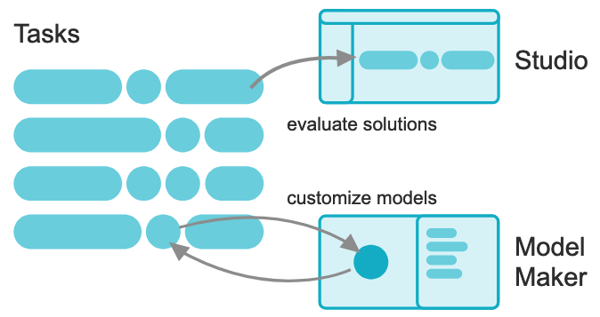

# MediaPipe Solutions (MediaPipe 解決方案指南)

MediaPipe Solutions 提供一系列的程式庫(libraries)和工具，可讓你在應用程式中快速套用機器學習相關技術。你可以立即將這些解決方案插入應用程式且根據自身需求加以自訂，並用於多個開發平台。MediaPipe Solutions 屬於 [MediaPipe 開放原始碼專案](https://github.com/google-ai-edge/mediapipe)的一部分，因此可以根據應用程式需求進一步自訂解決方案程式碼。MediaPipe 解決方案套件包含下列項目：

These libraries and resources provide the core functionality for each MediaPipe Solution:

- [MediaPipe Tasks](https://ai.google.dev/edge/mediapipe/solutions/tasks): Cross-platform APIs and libraries for deploying solutions.
- `MediaPipe Models`: Pre-trained, ready-to-run models for use with each solution.

這些工具可讓您自訂及評估解決方案：

- [MediaPipe Model Maker](https://ai.google.dev/edge/mediapipe/solutions/model_maker?hl=zh-tw): 使用自己的資料自訂解決方案的模型。

- [MediaPipe Studio](https://ai.google.dev/edge/mediapipe/solutions/studio?hl=zh-tw): 在瀏覽器中以視覺化方式呈現、評估解決方案，以及進行基準測試。
