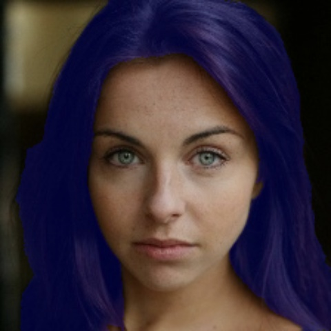

# Hair Segmentation with MediaPipe Tasks

## Preparation

Download an off-the-shelf model. Check out the [MediaPipe documentation](https://developers.google.com/mediapipe/solutions/vision/image_segmenter/index#models) for more Hair Segmentation models information.

```bash
$ mkdir -p model
$ wget -q -O model/deeplabv3.tflite -q https://storage.googleapis.com/mediapipe-models/image_segmenter/deeplab_v3/float32/1/deeplab_v3.tflite
```

## Running inference and visualizing the results

```bash
$ python3 hair_segmentation.py
```

Result:

<figure class="half">
    
    
</figure>
